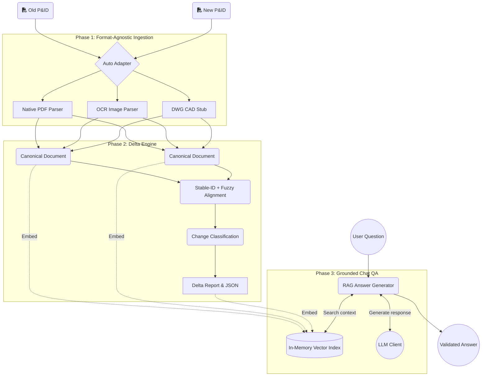

# PID Delta Chat

Compare two revisions of a P&ID (Piping & Instrumentation Diagram), compute a structured delta, and ask grounded questions about the changes. Inputs can be PDFs or image files.

## Quick Start

```bash
# Install
uv sync --extra dev

# Copy env and set your LLM key
cp .env.example .env
# Edit .env — set PID_LLM_API_KEY

# Optional: enable Langfuse observability
# LANGFUSE_PUBLIC_KEY=...
# LANGFUSE_SECRET_KEY=...
# LANGFUSE_BASE_URL=https://cloud.langfuse.com

# Launch web UI
make web
# or: uv run python main.py web

# Optional for OCR on scanned PDFs and image files
# Ubuntu/Debian: sudo apt install tesseract-ocr
# macOS: brew install tesseract
```

Open http://127.0.0.1:7860, upload two PDF revisions, and click **Run Delta Analysis**.

## CLI Usage

```bash
# Full pipeline (ingest → delta → report)
make run OLD=data/samples/old.pdf NEW=data/samples/new.pdf

# Interactive chat
make chat OLD=data/samples/old.pdf NEW=data/samples/new.pdf

# Eval harness
make eval OLD=data/samples/old.pdf NEW=data/samples/new.pdf GT=eval/datasets/ground_truth.json

# Sample OCR image eval
make sample-image-eval
```

## System Architecture

The application pipeline is built around a decoupled, three-phase architecture that isolates ingestion, delta computation, and retrieval-augmented generation (RAG).



### Pipeline Breakdown
1. **Ingestion (Adapters):** The system dynamically inspects incoming files and routes them to the correct parser (e.g., PyMuPDF for native vectors, Tesseract for raster images). All parsers yield a normalized `CanonicalDocument`.
2. **Delta Computation:** The alignment engine maps elements between the old and new canonical documents using exact stable IDs (like `PI-101-01`), falling back to fuzzy string matching. It then classifies the differences into Additions, Deletions, and Modifications.
3. **Retrieval-Augmented Chat:** The canonical elements and the computed delta report are embedded into an in-memory vector store. When a user asks a question, the system retrieves relevant components and forces the LLM to cite exactly where it found the information (`[PID:source:element_id]` or `[delta:id]`).

## Key Design Decisions & Trade-offs

- **Format-Agnostic Canonical Model:** Instead of writing distinct comparison logic for PDFs, Images, and CAD files, all adapters map native data into a uniform `CanonicalDocument` schema. This completely decouples the delta engine and RAG systems from the ingestion layer.
- **Native OpenAI over LangChain:** We deliberately chose to write a native RAG implementation (`RetrievalIndex`, `LLMClient`) using the standard OpenAI SDK rather than importing LangChain. LangChain introduces massive, opaque abstractions that hinder debugging and tight iteration. By owning every line of our QA logic, we retain strict deterministic control over our citation enforcement and trace boundaries.
- **Stable-ID Alignment First:** Elements with tag numbers or line specs match by exact ID. Unmatched elements fall back to fuzzy text similarity (`rapidfuzz`). This hybrid approach maximizes both precision and recall.
- **Strict Citation Enforcement:** Chat answers must cite `[PID:source:page:element_id]` or `[delta:entry_index]`. The system prompt is engineered to refuse ungrounded answers.

## Observability & Evaluation Approach

- **Unified Correlation:** We use `structlog` for structured, JSON-formatted console logging, injecting a unique `correlation_id` (or `X-Request-ID`) at the boundary of every Web request, CLI execution, or Evaluation run.
- **Why Langfuse?:** We explicitly chose Langfuse over alternatives (like LangSmith or Phoenix) because of its OpenTelemetry-native architecture and excellent self-hosting posture. It avoids vendor lock-in and provides an extremely clean `@observe` decorator pattern that seamlessly integrates with our custom `structlog` correlation IDs without demanding a massive framework rewrite.
- **Deep Tracing with Langfuse:** We integrated Langfuse's OpenTelemetry SDK to capture hierarchical execution spans, stage timings, and automatic LLM token/cost tracking. Using `propagate_attributes`, we dynamically tie the Langfuse `session_id` directly to our application's `correlation_id`, ensuring 1:1 parity between logs and traces.
- **Automated Harness (LLM-as-a-judge):** Our evaluation suite scores Delta accuracy (Precision, Recall, F1) against JSON ground truth. We implemented an LLM-as-a-judge to evaluate Chat responses on two axes: **Correctness** (does it match ground truth?) and **Groundedness** (are citations valid?). It produces a **Candid Failure Table** summarizing exactly where the system falls short, ensuring regressions are caught instantly.

## What We Deliberately Cut

- **Persistence:** No database. Session state is stored in-memory per session.
- **Real vector DB:** Uses in-memory cosine similarity instead of Chroma/Pinecone.
- **Async Pipeline:** All ingestion/delta code is synchronous.
- **DWG Implementation:** We built the `dwg.py` stub to prove the adapter seam, but left ODA/ezdxf integration out of scope for this sprint.


